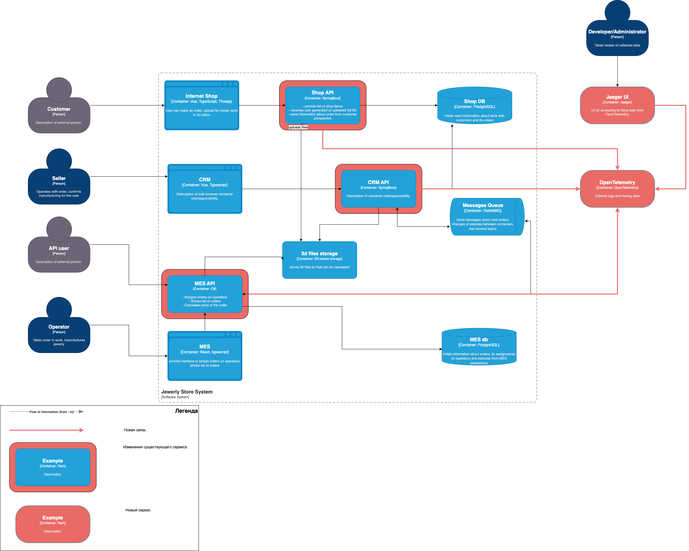

# Архитектурное решение по трейсингу

## Анализ
Что следует покрыть трейсингом:
1. API прикладных сервисов (MES, CRM, Shop) 

Список данных для трейсинга:
1. Trace Id
2. Id заказа
3. Id клиента
4. Id оператора
5. Id файла 3d модели
6. Статус заказа

## Мотивация 
При внедрении трейсинга мы получим:
1. Улучшенную диагностику проблем: повышение скорости выявления проблемных мест
2. Улучшенную производительность: анализ задержек в переходе статусов заказов

## Предлагаемое решение
Предлагается внедрить OpenTelemetry для реализации трассировки, сбора метрик и логов.

Для визуализации и анализа данных собранных OpenTelemetry будем использовать Jaeger. 

## Компромиссы
1. OpenTelemetry будет сложно или невозможно внедрить в проприетарные решения
2. Если планируется переход с синхронного API на асинхронный, то интеграция OpenTelemetry может оказаться невостребованной
3. В слишком простых или, наоборот, высоконагруженных системах интеграция трейсинга может, соответственно,  оказаться бесмысленной или создавать обратный эффект, ухудшая работу приложения

## Безопасность
1. Система трейсинга доступна только внутри VPN
2. Система трейсинга должна быть подключена к корпоративной системе аутентификации
3. Разграничение доступных данных по ролям/набору прав пользователей

## Дополнительное задание
\-