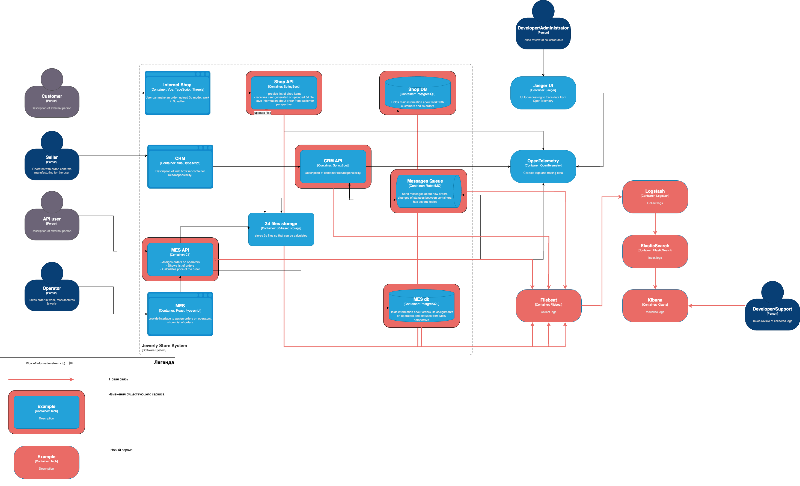

# Архитектурное решение по логированию

## Анализ
Список систем для которых требуется сбор логов:
1. Shop API
   1. входящие запросы
   2. загрузка файлов
   3. взаимодействие с БД

2. CRM API
   1. входящие запросы
   2. статусы заказов
   3. отправленные и полученные сообщения из RabbitMQ

3. MES API
   1. расчет стоимости модели
   2. взаимодействие с БД
   3. отправленные и полученные сообщения из RabbitMQ
   
4. RabbitMQ
   1. метаданные о работе кластера: клиенты, очереди, размер

5. PostgreSQL
   1. метаданные о работе кластера: клиенты, соединения, журнал запросов

Список необходимых логов с уровнем INFO:
1. Изменение статуса заказа
   1. время возникновения события
   2. id заказа
   3. старый статус
   4. новый статус
   5. id оператора
2. Загрузка/выгрузка моделей из S3
   1. время возникновения события
   2. id файла
   3. тип операции
3. Сообщения RabbitMQ
   1. время получения сообщения
   2. название очереди или routing key
   3. тип сообщения
4. Access логи
   1. Время возникновения события
   2. IP адрес
   3. URL запроса
   4. Код ответа
   5. Время ответа
   6. Размер тела ответа
   7. Параметры запроса

Уровни **DEBUG** и ниже обычно используют во время разработки или тестирования для сбора более детальной информации о работе приложения.

Уровень **WARN** используется для предупреждения о чём-то странном в работе приложения, но при этом не критичном.

Уровень **ERROR** и выше сообщают о случившейся ошибке, на которую, скорее всего, требуется оперативная реакция.

## Мотивация
Логирование - неотъемлемая часть инструментария разработчика во время разработки и сопровождения приложения.
Без логов приложения будет практически невозможно разобраться в каких-либо проблемах и, следовательно, устранить их.

Внедрение централизованного логирования позволит:
1. Сокращение длительности разбора инцидентов
   
   Собирать логи в микросервисной архитектуре - то еще удовольствие. На это уходит очень много времени, а время квалифированного разработчика стоит недешево.

2. Повысить прозрачность процессов
   
   В собранных логах можно будет достаточно оперативно найти информацию о том, когда произошло то или иное действие и, если доступна информация такого рода, то еще и кто инициировал собственно само действие.

### Метрики
* Error Rate - количество ошибок в сервисах
* Response Time - соответствие SLA
* MTTR (Mean Time to Repair) - длительность устранения проблемы; при наличии централизованного логирования должно оставаться низким
* MTTD (Mean Time to Detect) - задержка на обнаружение инцидента

### Приоритет сервисов на внедрение логирования
1. MES API - стоит начать с него, т.к. большое количество жалоб связано с работой именно этого сервиса
2. CRM API - опрозрачить смену статусов заказов из-за жалоб клиентов

## Предлагаемое решение

### Технологический стек
Логирование логично реализовать с помощью устоявшихся решений, а именно ELK (ElasticSearch/Logstash/Kibana). 

Для централизованного сбора логов важно, чтобы они были в одном формате, например json.

Сбор логов можно реализовать с помощью Filebeat.

### Политика безопасности
1. Логирование чувствительных данных должно быть запрещено или они должны быть замаскированы.
2. Система просмотра логов доступна только внутри VPN
2. Система просмотра логов должна быть подключена к корпоративной системе аутентификации
3. Разграничение доступных данных по ролям/набору прав пользователей

### Политика хранения
С учетом того, что наше решение построено с помощью ElasticSearch, будет логично воспользоваться ILM (Index Lyfecycle Management) для того, чтобы автоматически создавался новый индекс при достижении определенного размера, а старый при этом становился доступен в режиме read only.

Оперативными логами будем считать логи за последние 4 недели (согласно SLA). Такой период выбран исходя из того, что могут потребоваться данные для разбора инцидентов и/или обращений клиентов, которые еще не получили свой заказ несмотря на прошедшее время (больше 3 недель).

Архивные логи - старше 4 недель - будет лучше перенести на какое-то из холодных хранилищ, так как оперативный доступ к ним не требуется, а значит можно использовать решения подешевле.

## Система анализа логов
Для превращения системы сбора логов в систему анализа логов нужно настроить минимальные правила для срабатывания триггеров, которые будут отправлять алерты.

Например,
1. если случился всплеск записей уровня ERROR автоматически заводить задачу соответствующего уровня (поскольку это production, то не ниже Critical/Blocker) в системе тикетов; уведомить ответственных.
2. проработать граничные значения метрик (ручные правила), которые позволят обнаруживать аномалии вида "десятки тысяч запросов на загрузку 3d модели", т.е. рост в разы или внедрить ML для автоматического поиска аномалий подобного рода.
По результату - уведомить ответственных.

## Дополнительное задание
\-
