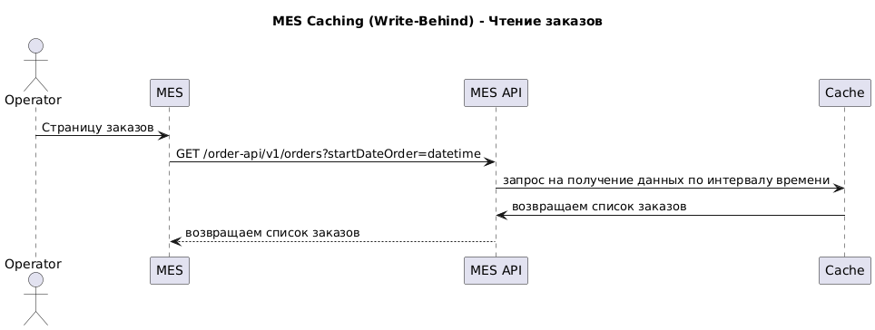
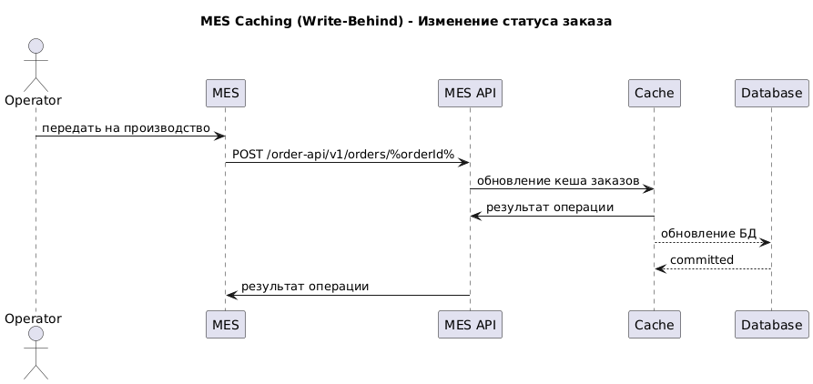

# Архитектурное решение по кешированию

## Анализ
Самую большую пользу принесет кеширование MES API, т.к. операторы наблюдают большие задержки при получении данных.

Далее можно кешировать остальные части системы, они примерно равнозначны. Ожидаемый эффект от этого это снижение нагрузки на БД, т.к. в виде источнике актуальных данных будет использоваться кеш.

## Мотивация
Кеширование - самый простой и при этом эффективный способ кратно повысить быстродействие приложения без существенных затрат в виде дополнительного железа или человеко-часов.

Стоит рассмотреть вариант с кешированием запросов в БД, т.к. это так же повысит скорость работы в целом, но основная идея в том, чтобы закешировать данные MES API для решения проблемы с долгой загрузкой данных у операторов.
   
## Предлагаемое решение
Клиентское кеширование требует очень тщательного проектирования и не даёт гарантий надежной и стабильной работы. Поэтому, если что-то и кешировать на стороне клиента, то это могут быть только очень редко изменяемые файлы, такие как стили, картинки, шрифты, которые не оказывают существенного влияния на работу пользователя.

### Варианты серверного кеширования
1. Cache-Aside

    Если не находит данные в кеше, то выполняет запрос в БД.
    
    Плюсы: прост в реализации.
    
    Минусы: не даёт существенных преимуществ.

2. Write-Through

    Запись в БД выполняется через кеш. 

    Плюсы: данные в кеше всегда актуальны.

    Минусы: взаимодействие кеша с БД - синхронное.

3. Refresh-Ahead

    Приложение асинхронно обновляет кеш для поддержки его в актуальном состоянии.
    
    Плюсы: прост в реализации.

    Минусы: возможны промашки.

Оптимальным выбором будет комбинация использование Refresh-Ahead на старте приложения для разогрева кеша и, когда приложение начнет принимать нагрузку, использование Write-Behind. Использование Write-Behind даёт плюсы от Write-Through, где данные в кеше всегда актуальны и за счет асинхронного взаимодействия с БД, нивелирует минусы метода Write-Through.
Важные моменты:
* если данные БД сервиса, который использует метод кеширования Write-Behind, используются где-то еще - например, какая-то репликация через журнал транзакций - то возможна задержка в этом процессе.
* нужно аккуратно настроить выключение сервиса, т.к. при резком shutdown'е можно потерять данные, которые находятся в кеше, но при этом не были записаны в БД. 
Один из вариантов решения - писать в Кафку то, что пишем в БД, т.к. она быстрее и если случился форс-мажор, то на старте вычесть те записи из топиков, которые еще не были применены в БД.

### Диаграмма последовательностей
**Диаграмма последовательностей для чтения списка заказов**

**Диаграмма последовательностей для обновления статуса заказа**

## Стратегия инвалидации кеша

1. Программная инвалидация

    Этот метод валидации позволяет разработчику приложения полностью контролировать данные, которые были добавлены в кеш.
    
    Например, он может положить в кеш "вечный" элемент, без TTL и TTI и удалить его тогда, когда посчитает нужным.

    В нашем случае это может быть достижение заказом финального статуса. При достижении финального статуса асинхронная задача пройдется по всем связанным кешам и удалит те данные, которые имеют этот статус.

2. Временная инвалидация

    Другой оптимальный вариант это временная инвалидация, настроенная через TTI, т.е. через время последнего доступа к элементу.

    Например, можно настроить таким образом, что элемент удаляется через час после последнего доступа к нему. 

    В реальной жизни это означает, что он больше не востребован пользователями (это может быть какой-то заказ, который больше не просматривается, т.к. его статус сменился и больше не подпадает под фильтры).

    Плюсы этого метода - простота реализации, а минусы в том, что потребуется больше памяти на хранение "лишних" данных и что это будет сказываться на метриках: cache hit поползет вниз.

## Дополнительное задание
\-